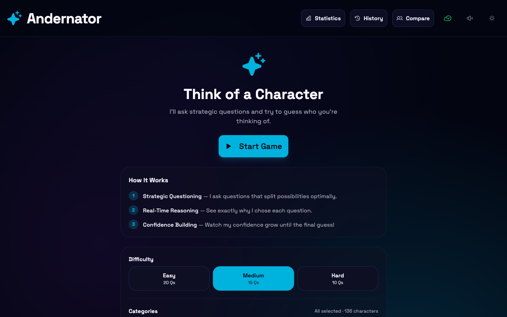
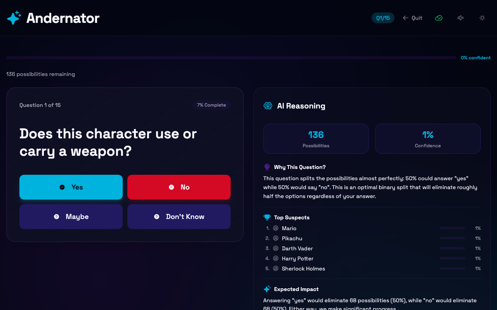
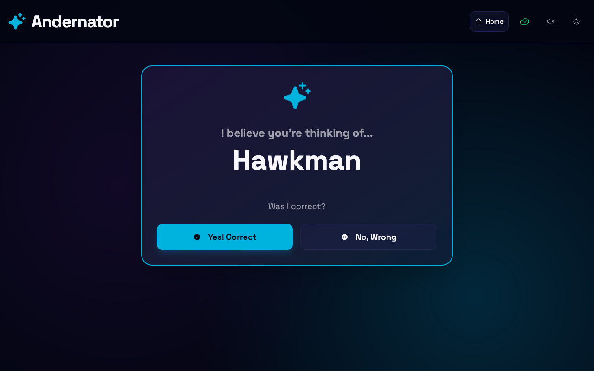

<div align="center">

# 🔮 Andernator

**An AI-powered guessing game that reads your mind through strategic deduction.**

[](https://github.com/and3rn3t/guess/actions/workflows/ci.yml)
[](LICENSE)
[](tsconfig.json)
[](https://andernator.com)

Think of a character. The AI asks strategic yes/no questions, uses Bayesian probability scoring and information gain optimization to narrow down the possibilities, then makes its guess — with full reasoning transparency showing you exactly how it thinks.

[**Play Now →**](https://andernator.com)

</div>

---

<div align="center">
  
  
  
</div>

## Features

- **Bayesian Deduction Engine** — Probability scoring with information gain optimization picks the most strategic question every turn
- **Reasoning Transparency** — See exactly why the AI asked each question and how your answers shift probabilities
- **Difficulty Selector** — Easy (20q) / Medium (15q) / Hard (10q); selection persists across sessions via localStorage
- **Category Filters** — 8 multi-select chips (Video Games, Movies, Anime, Comics, Books, Cartoons, TV Shows, Pop Culture) narrow the candidate pool; daily challenge always uses the full pool
- **Daily Challenge** — Everyone thinks of the same character each day; completion state persists across sessions
- **Teaching Mode** — When the AI guesses wrong, teach it the character; all answered attributes are saved automatically
- **User Answer Reveal** — On a loss, disclose who you were thinking of; the AI backfills null attributes from your answers and queues correction votes
- **53K+ Character Database** — Server-side engine backed by D1 with 224 enriched attributes per character
- **AI-Enhanced Answers** — Free-text answer parsing via GPT-4o understands natural language responses
- **Statistics Dashboard** — Win/loss tracking, question performance metrics, attribute entropy analysis
- **Character Comparison** — Side-by-side attribute diffs, similarity scoring, discrimination power analysis
- **AI Attribute Recommendations** — GPT-4o suggests and fills in character attributes with detailed reasoning
- **Keyboard Shortcuts** — Y / N / M / U answer the current question without lifting your hands off the keyboard
- **Touch-Optimized UI** — Gradient answer buttons (emerald/rose/amber/slate), spring-physics guess reveal with animated rings, confetti win screen, answer history pills with stagger animation
- **Offline Support** — PWA with service worker caching for offline gameplay
- **Sound Effects** — Web Audio API tone synthesis (no audio files needed)

## Tech Stack

| Layer | Technology |
|---|---|
| Framework | React 19 · TypeScript (strict) · Vite 7 |
| Styling | Tailwind CSS v4 · shadcn/ui · Framer Motion |
| Data | Cloudflare D1 (SQLite) · KV · R2 |
| AI | OpenAI GPT-4o via Cloudflare AI Gateway |
| Platform | Cloudflare Pages + Workers |
| Testing | Vitest · Playwright · MSW |
| Icons | Phosphor Icons · Lucide |
| Charts | Recharts · D3 |

## Quick Start

```bash
# Install dependencies
pnpm install

# Start dev server (http://localhost:5000)
pnpm dev
```

## Commands

| Command | Description |
|---|---|
| `pnpm dev` | Start Vite dev server |
| `pnpm build` | Type-check + production build |
| `pnpm preview` | Preview production build locally |
| `pnpm lint` | Run ESLint |
| `pnpm validate` | Type-check + lint + test (full check) |
| `pnpm test` | Run all Vitest tests |
| `pnpm test:unit` | Unit tests only (excludes components) |
| `pnpm test:components` | Component tests only |
| `pnpm test:e2e` | Playwright E2E tests (auto-starts preview server; requires a build) |
| `pnpm test:coverage` | Tests with coverage report |
| `pnpm deploy` | Build + deploy to Cloudflare Pages (production) |
| `pnpm deploy:preview` | Build + deploy preview branch |
| `pnpm cf:login` | Authenticate with Cloudflare |
| `pnpm cf:dev` | Dev server with Cloudflare bindings (KV, D1, R2) |
| `pnpm db:types` | Regenerate D1 row types from migrations |
| `pnpm migrate:create` | Scaffold a new timestamped migration file |
| `pnpm migrate:preview` | Apply pending D1 migrations to preview |
| `pnpm migrate:prod` | Apply pending D1 migrations to production |
| `pnpm analytics:readiness:preview` | Run guess-readiness calibration queries against preview D1 |
| `pnpm analytics:readiness:prod` | Run guess-readiness calibration queries against production D1 |
| `pnpm ingest` | Run data ingestion pipeline |

## Architecture

The app runs as a React SPA on Cloudflare Pages with Workers handling API endpoints, D1 for the character database, KV for game sessions, and R2 for character images.

```
Client (React SPA)  →  Cloudflare Workers  →  D1 / KV / R2
                              ↓
                        AI Gateway → OpenAI
```

All gameplay runs through the server-side Bayesian engine, querying D1 (53K+ characters, top 500 per session). The client is a thin UI shell that sends answers and renders server-computed questions, reasoning, and guesses.

See [ARCHITECTURE.md](ARCHITECTURE.md) for the full system design, game engine internals, API reference, data layer details, and CI/CD pipeline.

## Project Structure

```
src/
├── components/        # React components (24 feature + shadcn/ui primitives)
├── hooks/             # Custom hooks (game state, KV, server game, sound, etc.)
├── lib/               # Business logic (engine, types, database, LLM, analytics)
└── styles/            # Theme CSS (cosmic purple/indigo, Space Grotesk)
functions/api/         # Cloudflare Workers (v1 KV, v2 D1, LLM, images, admin)
scripts/               # Data ingestion & seed generation tools
migrations/            # D1 schema migrations
e2e/                   # Playwright E2E tests
```

## Deployment

Deployed to [Cloudflare Pages](https://andernator.com) via `wrangler`. See [`.github/prompts/deploy.prompt.md`](.github/prompts/deploy.prompt.md) for deployment guide and the [CI pipeline](.github/workflows/ci.yml) for automated deployments.

```bash
pnpm deploy            # Production
pnpm deploy:preview    # Preview branch
```

## Analytics Calibration

Guess timing now records dedicated readiness analytics in `game_stats`, including trigger type, forced guesses, top-gap, alive suspects, and questions remaining at guess time.

```bash
pnpm analytics:readiness:preview
pnpm analytics:readiness:prod
```

These commands run the query set in [docs/guess-readiness-queries.sql](docs/guess-readiness-queries.sql) against the remote D1 databases so threshold tuning can be based on real outcomes instead of heuristics alone.

Calibration targets and review guidance live in [docs/guess-readiness-calibration.md](docs/guess-readiness-calibration.md).

## D1 Operations

Use these commands for the normal schema workflow:

```bash
pnpm migrate:create
pnpm migrate:preview
pnpm migrate:prod
pnpm db:types
```

Apply the migration to preview first, then production, and regenerate [functions/api/_db-types.ts](functions/api/_db-types.ts) after schema changes land.

## License

[MIT](LICENSE)
